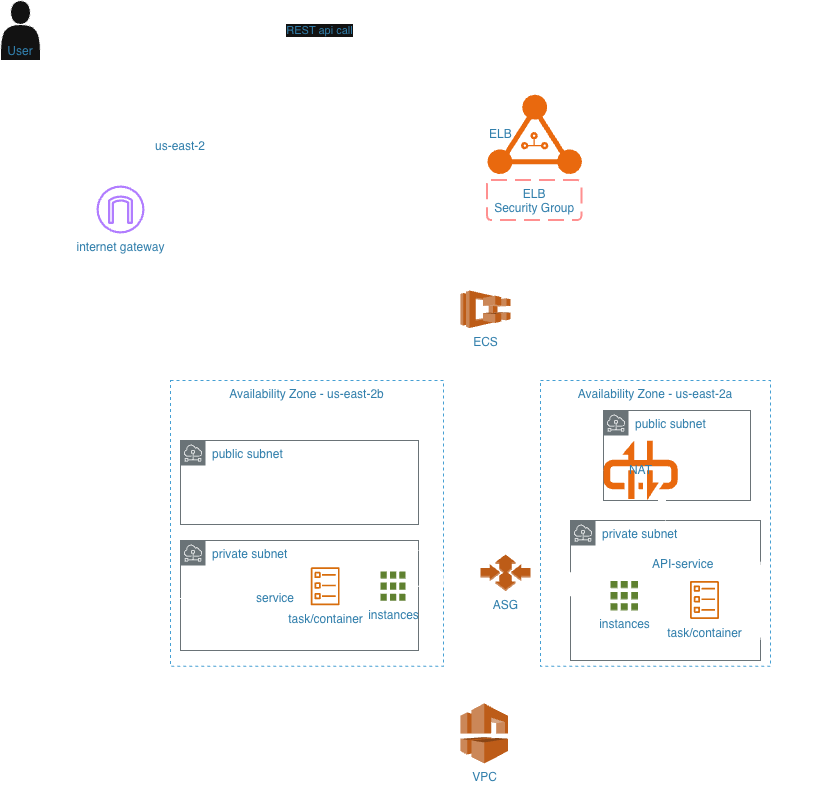

# checkpoint-home-assignment

This project demonstrates a simple microservices architecture deployed on AWS using Terraform, ECS (EC2 launch type), and GitHub Actions for CI/CD.

## Architecture & Design Decisions

- Terraform State Management
  - Terraform remote state is stored in a dedicated S3 bucket. The bucket itself is bootstrapped using local state from the init/ folder,
    after which all infrastructure is managed using S3-backed remote state files.

- **VPC & Networking**
  - I’m using the official Terraform VPC module.
  - For cost optimization, the setup uses a **single NAT Gateway** shared by two private subnets.
  - In a real production environment, it’s recommended to use **one NAT Gateway per AZ** to ensure high availability.

- **Authentication & CI/CD Access**
  - GitHub Actions is connected to the AWS account using **OIDC**.
  - An IAM role with a proper trust relationship is created via Terraform and assumed by GitHub Actions (no static AWS credentials).

- **CI Pipeline**
  - CI builds Docker images on pull requests.
  - On merge to `main`, images are built and pushed to ECR.
  - Each microservice has a `version.txt` file that must currently be updated manually.
  - This can be improved by adding **automatic version bumping and auto-merge** in the future.

- **ECS & Load Balancing**
  - The home assignment explicitly required using a **Classic Load Balancer (ELB)**.
  - Since Classic ELB does not support dynamic port mapping or `awsvpc` networking, ECS is deployed using the **EC2 launch type**.
  - EC2 instances are managed via an **Auto Scaling Group** with a launch template and instance profile.
  - In a production environment without this constraint, an **Application Load Balancer (ALB)** with dynamic port mapping or Fargate would be preferred.

- **Image Versioning & Deployment**
  - For simplicity, the `latest` image tag is used.
  - The CD pipeline forces a new deployment after each image push.
  - In production, a GitOps approach (e.g., **Argo CD**) would be preferable, deploying based on Git state rather than forcing updates.

- **Worker Service (Service 2)**
  - The worker service continuously long-polls messages from SQS.
  - It is implemented as an ECS **service**, not a scheduled task, for simplicity.
  - In a production system, this could also be implemented using:
    - Scheduled ECS tasks
    - Event-driven architectures
    - Or autoscaling based on SQS depth

## Usage

- API endpoint (via ELB) and token will be send over email.

### Load Balancer

The assignment specifies the use of an **Elastic Load Balancer (ELB)**.
Based on this requirement, the implementation uses a **Classic Load Balancer**
integrated with ECS on the EC2 launch type.

This approach requires static port mapping and results in one running task per
EC2 instance, which is handled via Auto Scaling.

In a production-grade system, an **Application Load Balancer (ALB)** would
typically be preferred to support dynamic port mapping, higher task density,
and more flexible routing. The current setup follows the assignment wording
and keeps the implementation aligned with the stated requirements.

### Network & Compute Architecture

### Application / Service Flow

